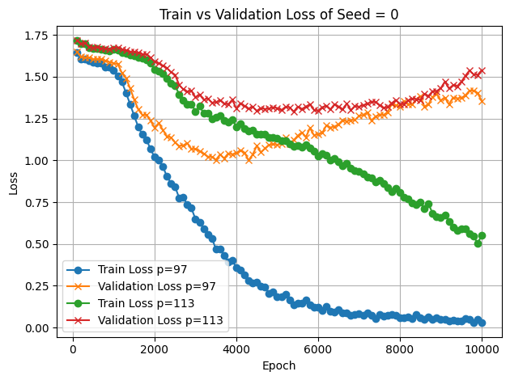
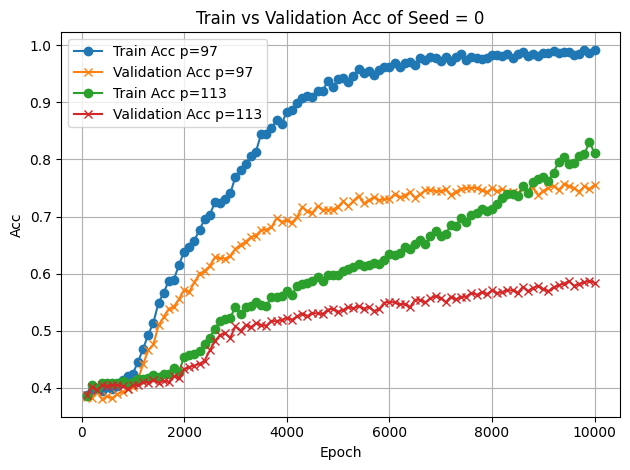
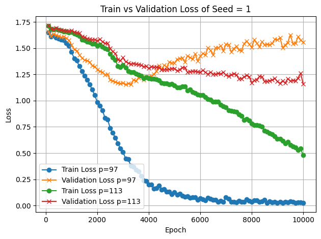
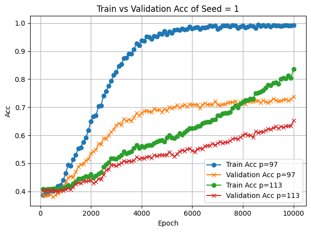
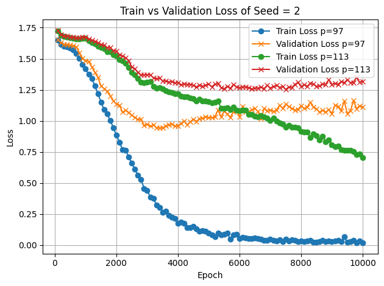
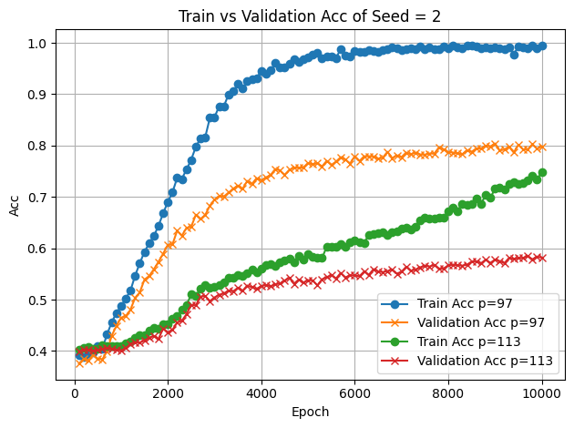
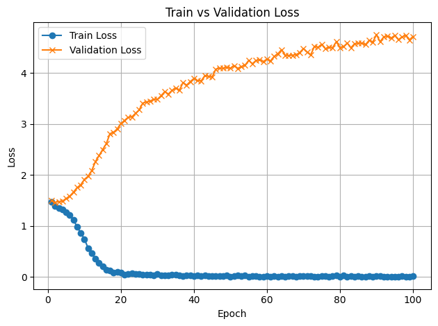
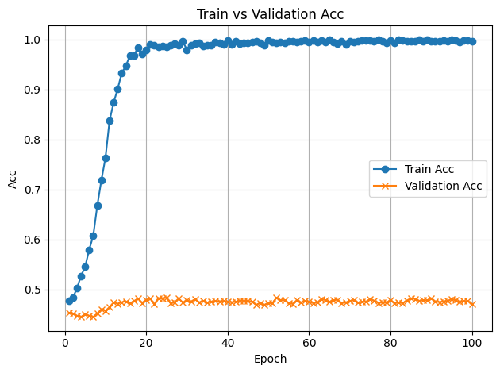
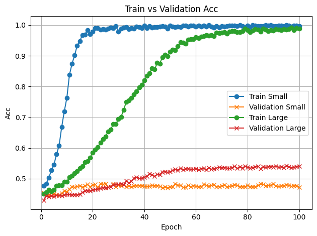

## Part 1
The log is [here](/handin/part1_log.txt). Model checkpoint is [here](/part1). `train.py` is [here](/part1). `inference.py` is [here](/part1). \
Go to part1, \
For training,
```
python train.py textfile.txt \
    --n_layer 1 \
    --n_head 2 \
    --n_embd 32 \
    --block_size 16 \
    --batch_size 1 \
    --out_dir ckpt
```

For inference, `python inference.py ckpt/model.pt --prompt "I" --steps 22` \
To overfit "I love machine learning", we set the configuaration of GPT smaller than its default to avoid the model taking this as an complex task. We were doing character-level tokenization and wrote corespponding char dataset. We used AdamW as our optimizer and F.cross_entropy as the criterion. We trained this single text over 5000 epochs and make sure it was overfitting.

## Part 2
### 2.1 Data Generation
We have 5000 samples for p=97 and p=113, respectively. For each p, the size of the train samples is 2000, the size of the validation samples is 2000, and the size of the test is 1000. 

```
    ops = ['+', '-']
    a = random.randint(0, p)
    b = random.randint(1, p)
    op = random.choice(ops)

    # find c
    if op == '+':
        c = (a + b) % p
    else:
        c = (a - b) % p

    data = f"{a}{op}{b}={c}"
```
The above code is how we generate a single sample. Then we repeat this process 5000 times for each `p`.
After that, we split the data via the following code (5000*0.4=2000) and save the data in `txt` file: \
all samples = |--train--|--val--|--test--| \
train is 40%, val is 40%, and test is 20%
```
random.shuffle(data)
n = len(data)
train_end = int(n * 0.4)
val_end = int(n * 0.8)

path_prefix.mkdir(parents=True, exist_ok=True)

with open(path_prefix / f"train_{fname}.txt", "w") as f:
    f.write("\n".join(data[:train_end]))

with open(path_prefix / f"val_{fname}.txt", "w") as f:
    f.write("\n".join(data[train_end:val_end]))

with open(path_prefix / f"test_{fname}.txt", "w") as f:
    f.write("\n".join(data[val_end:]))
```

### 2.2 Warmup - Addition and Subtraction Experiments
seed=0 loss
 \
seed=0 acc
 \
seed=1 loss
 \
seed=1 acc
 \
seed=2 loss
 \
seed=2 acc
 \
[Checkpoint](/part2/ckpt_task22) \
Through three seeds of experiments, we noticed that p=113 is harder to learn than using p=97. We guessed that this is because p=113 has larger data diversity. Therefore, under same situation, data of p=113 is more complex to be learned while our model remained relatively simple. The final loss in test dataset across three seeds is 1.3807 for p=97 and 1.3757 for p=113. The final accuracy in test dataset across three seeds is 0.7563 for p=97 and 0.6045 for p=113.

### 2.3 Grokking
 \
 \
The checkpoint is [here](/part2/ckpt_task22/) of seed=42. \
For training: \
```
python3 train23.py . \
    --prime 97 \
    --operators "/" \
    --n_layer 2 \
    --max_iters 10000 \
    --eval_interval 100 \
    --batch_size 32 \
    --device cpu
```

### 2.4 Ablations/Analysis
Increase the size of the dataset helps gorkking on division task faster and reliable in validation, not training. As shown,
 \
Under the condition of small samples, the model quickly remembers the training set (Acc is about 1.0), but due to insufficient patterns, extrapolation is impossible, and the validation set remains near random guessing (about 0.49). This is precisely what is called the silent period in grokking's literature

In the large sample setting, although the memory stage slows down, the verification accuracy significantly improves with training. The gap of the training-verification curve Narrows become smaller comparing with small size sample, indicating that the model learns the generalizable internal representation earlier. We can directly see that the large sample validation accuracy is higher than small sample validation accuracy.

Therefore, in the arithmetic grokking task, the number of training samples is the primary factor determining the generalization speed and final performance. If hardware and time permit, prioritizing the increase of data volume is more effective in eliminating the grokking phenomenon than adjusting the learning rate or regularization in isolation.

