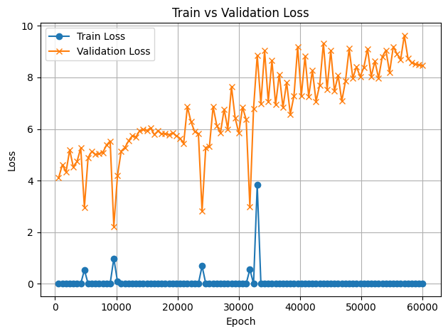
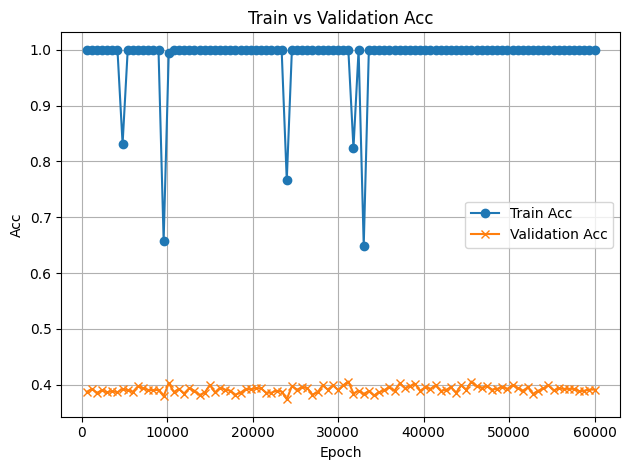
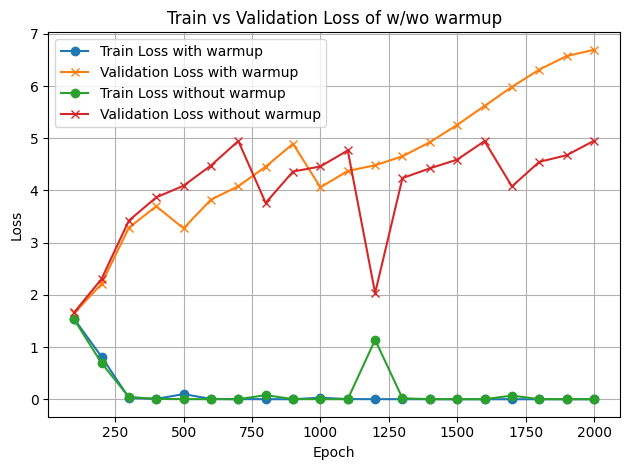
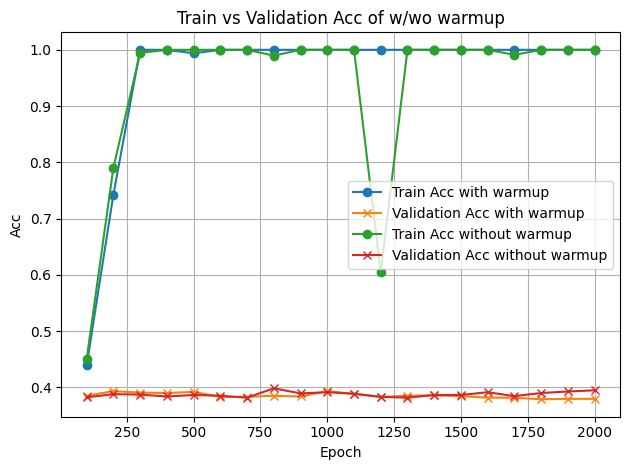

## Part 1
The log is [here](/handin/part1_log.txt). Model checkpoint is [here](/part1). `train.py` is [here](/part1). `inference.py` is [here](/part1). \
Go to part1, \
For training,
```
python train.py textfile.txt \
    --n_layer 1 \
    --n_head 2 \
    --n_embd 32 \
    --block_size 16 \
    --batch_size 1 \
    --out_dir ckpt
```

For inference, `python inference.py ckpt/model.pt --prompt "I" --steps 22` \
To overfit "I love machine learning", we set the configuaration of GPT smaller than its default to avoid the model taking this as an complex task. We were doing character-level tokenization and wrote corespponding char dataset. We used AdamW as our optimizer and F.cross_entropy as the criterion. We trained this single text over 5000 epochs and make sure it was overfitting.

## Part 2
### 2.1 Data Generation
We have 5000 samples for p=97 and p=113, respectively. For each p, the size of the train samples is 2000, the size of the validation samples is 2000, and the size of the test is 1000. 

```
    ops = ['+', '-']
    a = random.randint(0, p)
    b = random.randint(1, p)
    op = random.choice(ops)

    # find c
    if op == '+':
        c = (a + b) % p
    else:
        c = (a - b) % p

    data = f"{a}{op}{b}={c}"
```
The above code is how we generate a single sample. Then we repeat this process 5000 times for each `p`.
After that, we split the data via the following code (5000*0.4=2000) and save the data in `txt` file: \
all samples = |--train--|--val--|--test--| \
train is 40%, val is 40%, and test is 20%
```
random.shuffle(data)
n = len(data)
train_end = int(n * 0.4)
val_end = int(n * 0.8)

path_prefix.mkdir(parents=True, exist_ok=True)

with open(path_prefix / f"train_{fname}.txt", "w") as f:
    f.write("\n".join(data[:train_end]))

with open(path_prefix / f"val_{fname}.txt", "w") as f:
    f.write("\n".join(data[train_end:val_end]))

with open(path_prefix / f"test_{fname}.txt", "w") as f:
    f.write("\n".join(data[val_end:]))
```

### 2.2 Warmup - Addition and Subtraction Experiments
seed=0 loss
 \
seed=0 acc
 \
seed=1 loss
 \
seed=1 acc
 \
seed=2 loss
 \
seed=2 acc
 \
[Checkpoint](/part2/ckpt_task22) \
Through three seeds of experiments, we noticed that p=113 is harder to learn than using p=97. We guessed that this is because p=113 has larger data diversity. Therefore, under same situation, data of p=113 is more complex to be learned while our model remained relatively simple. The final loss in test dataset across three seeds is 1.3807 for p=97 and 1.3757 for p=113. The final accuracy in test dataset across three seeds is 0.7563 for p=97 and 0.6045 for p=113.

### 2.3 Grokking
 \
 \
The checkpoint is [here](/part2/ckpt_task23/) of seed=42. \
For training: \
```
python3 train23.py . \
    --prime 97 \
    --n_layer 2 \
    --max_iters 10000 \
    --eval_interval 100 \
    --batch_size 32 \
    --device cpu
```
We set learning rate = 1e-3, weight decay = 1.0, batch size = 250 (the total training data size is 500), betas = (0.9, 0.98), n_head=4, n_embd=128, n_layer=2, dropout=0. And we trained for 60,000 epochs. (ps. we have tried larger dataset (size = 10000, which covers all possible `a / b = p mod c`), and the validation accuracy stays at 69%. This is because the diversity of the dataset). Due to the limitation of time, we could not train it long enough to see if grokking happened. \
For inference, `python3 inference.py --prompt "a/b="`, where `a, b <= p=97` and `b != 0`. \
As shown, we were not grokking as the train loss reaches 0 and train accuracy reaches 1.0. At the same time, validation loss increases and validaiton accuracy remains unchanged even after over 10,000 epochs.

### 2.4 Ablations/Analysis
Warmup before training helps the model learn faster and is more reliable with high weight decay (weight_decay = 1). Even though we were not grokking, the model with warmup performs better much eariler than the model without warmup.
As shown in the plot, the model with warmup is more stable. \


